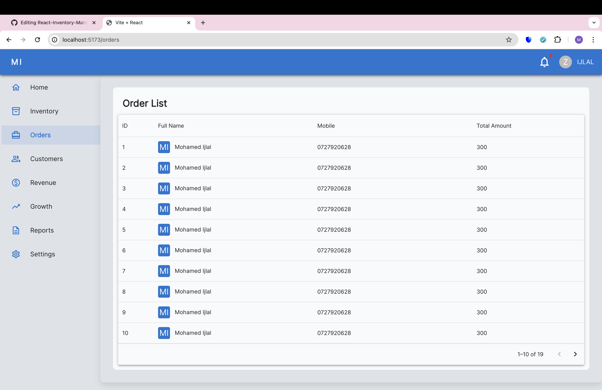

# inventory management system using React + Vite (Only Front End with static data)

- ### react libraries used in this app
- #### react Material UI
- #### react Router
- #### react Data Grid
- #### react Apex Charts
- #### react Material Icons
- #### Screen
- #### For screenshots check src/assets

clone this project on vs code and run "npm install" followed by "npm run dev" to run locally 

 
 
 
 
 
 

